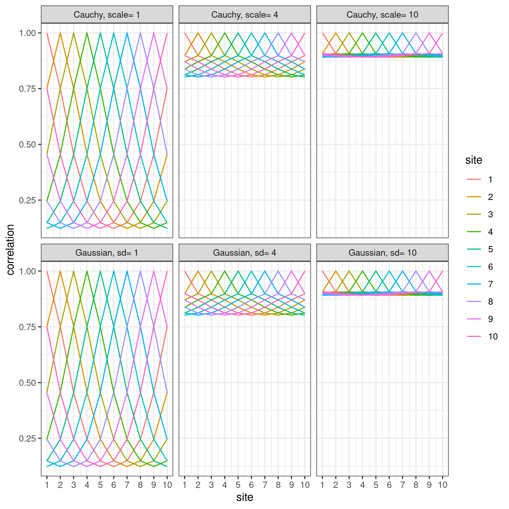
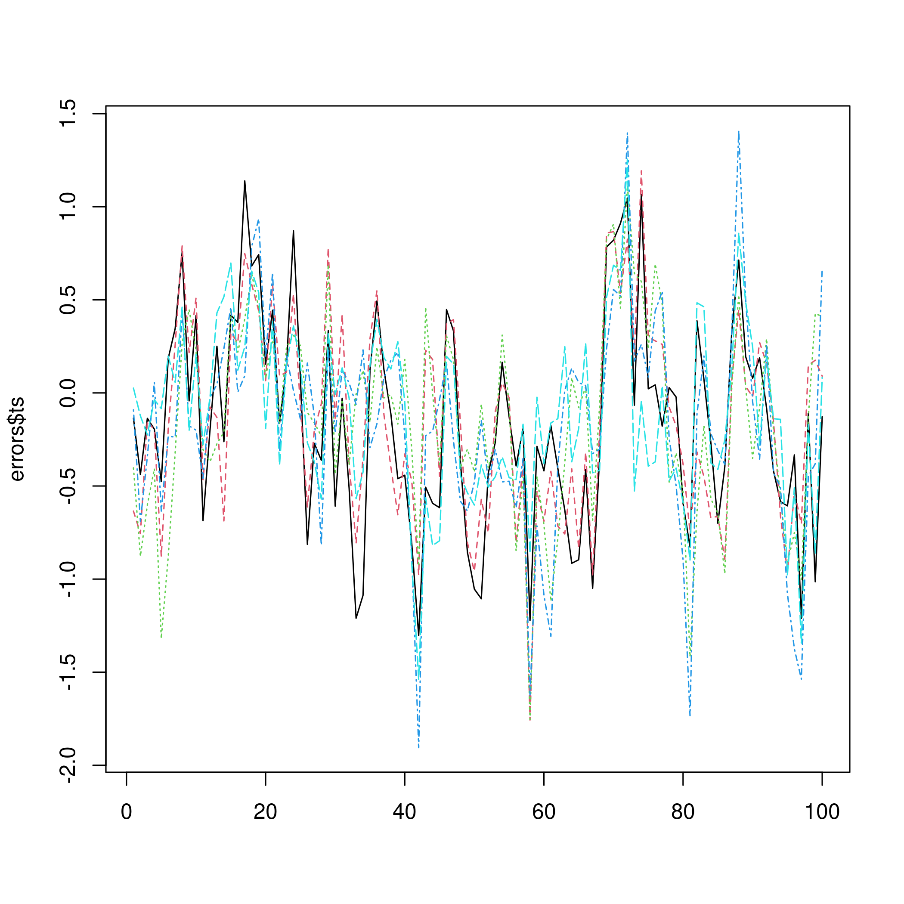
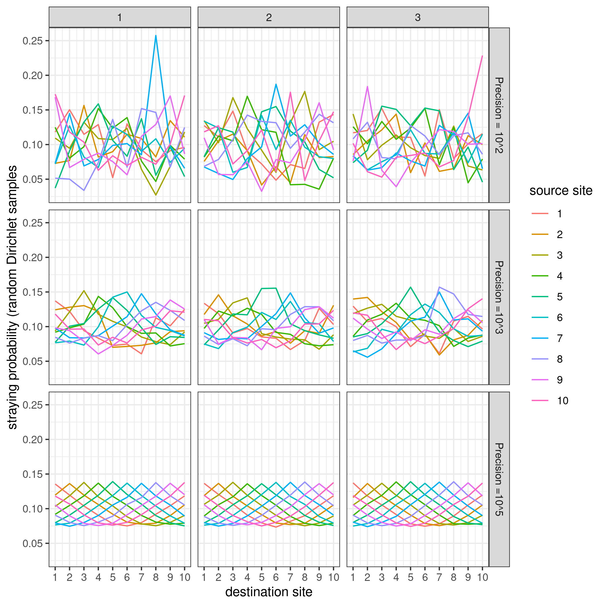
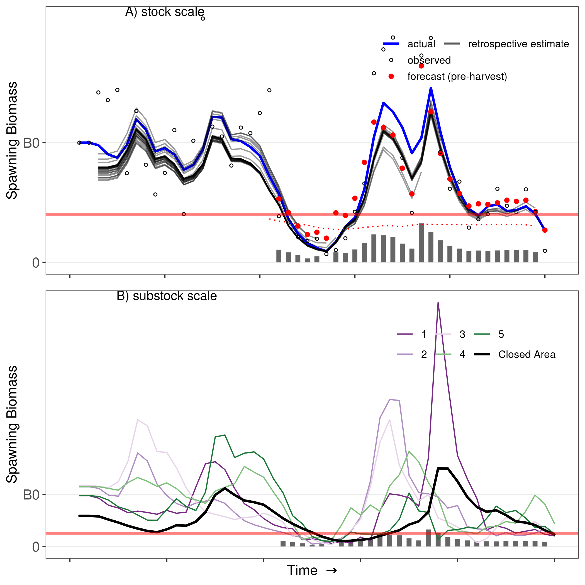

---
title: "Exploring some ode models"
output:
  html_document:
    keep_md: true
    toc: true
    toc_float: true
    theme: yeti
    highlight: haddock
    fig_caption: yes
---

<style type="text/css">
#TOC {
  color: black;
}
</style>


<style>
p.caption {
  font-size: 0.6em;
}
</style>

<style type="text/css">
.showopt {
  background-color: #004c93;
  color: #FFFFFF; 
  width: 100px;
  height: 20px;
  text-align: center;
  vertical-align: middle !important;
  float: right;
  font-family: sans-serif;
  border-radius: 8px;
}

.showopt:hover {
    background-color: #dfe4f2;
    color: #004c93;
}

pre.plot {
  background-color: white !important;
}
</style>


# Helper functions

There are a variety of helper functions.  Check out some of the helper files: 
## spatial correlation

```r
?spat_cor_mat
example(spat_cor_mat)
```

```
## 
## spt_c_> #a correlation matrix with 10 sites and sd of 4
## spt_c_> round(spat_cor_mat(n_loc=10,spat_sd=4,sumto1=FALSE),3)
##        [,1]  [,2]  [,3]  [,4]  [,5]  [,6]  [,7]  [,8]  [,9] [,10]
##  [1,] 1.000 0.898 0.871 0.838 0.812 0.802 0.812 0.838 0.871 0.898
##  [2,] 0.898 1.000 0.898 0.871 0.838 0.812 0.802 0.812 0.838 0.871
##  [3,] 0.871 0.898 1.000 0.898 0.871 0.838 0.812 0.802 0.812 0.838
##  [4,] 0.838 0.871 0.898 1.000 0.898 0.871 0.838 0.812 0.802 0.812
##  [5,] 0.812 0.838 0.871 0.898 1.000 0.898 0.871 0.838 0.812 0.802
##  [6,] 0.802 0.812 0.838 0.871 0.898 1.000 0.898 0.871 0.838 0.812
##  [7,] 0.812 0.802 0.812 0.838 0.871 0.898 1.000 0.898 0.871 0.838
##  [8,] 0.838 0.812 0.802 0.812 0.838 0.871 0.898 1.000 0.898 0.871
##  [9,] 0.871 0.838 0.812 0.802 0.812 0.838 0.871 0.898 1.000 0.898
## [10,] 0.898 0.871 0.838 0.812 0.802 0.812 0.838 0.871 0.898 1.000
## 
## spt_c_> #a stray th 10 sites and sd of 4
## spt_c_> round(spat_cor_mat(n_loc=10,spat_sd=4,sumto1=TRUE),3)
##        [,1]  [,2]  [,3]  [,4]  [,5]  [,6]  [,7]  [,8]  [,9] [,10]
##  [1,] 0.116 0.104 0.101 0.097 0.094 0.093 0.094 0.097 0.101 0.104
##  [2,] 0.104 0.116 0.104 0.101 0.097 0.094 0.093 0.094 0.097 0.101
##  [3,] 0.101 0.104 0.116 0.104 0.101 0.097 0.094 0.093 0.094 0.097
##  [4,] 0.097 0.101 0.104 0.116 0.104 0.101 0.097 0.094 0.093 0.094
##  [5,] 0.094 0.097 0.101 0.104 0.116 0.104 0.101 0.097 0.094 0.093
##  [6,] 0.093 0.094 0.097 0.101 0.104 0.116 0.104 0.101 0.097 0.094
##  [7,] 0.094 0.093 0.094 0.097 0.101 0.104 0.116 0.104 0.101 0.097
##  [8,] 0.097 0.094 0.093 0.094 0.097 0.101 0.104 0.116 0.104 0.101
##  [9,] 0.101 0.097 0.094 0.093 0.094 0.097 0.101 0.104 0.116 0.104
## [10,] 0.104 0.101 0.097 0.094 0.093 0.094 0.097 0.101 0.104 0.116
## 
## spt_c_> # illustrate different parameter values
## spt_c_> library(RColorBrewer)
## 
## spt_c_> a <- data.frame(n_loc= rep(10,3),spat_scale=c(1,4,10),spat_sd=c(1,4,10))
## 
## spt_c_> b <- array(cbind(with(a,mapply(spat_cor_mat,spat_scale=spat_scale,n_loc=n_loc)),
## spt_c_+            with(a,mapply(spat_cor_mat,spat_sd=spat_sd,n_loc=n_loc))),dim= c(10,10,6))
## 
## spt_c_> df1 <- melt(b,varnames = c("site1","site2","parameter"),value.name="correlation")
## 
## spt_c_> df1$site1 <- factor(df1$site1)
## 
## spt_c_> df1$parameter <- factor(df1$parameter, labels= 
## spt_c_+   c(paste(rep(c("Cauchy, scale=","Gaussian, sd="),each= 3),rep(c(1,4,10),2))))
## 
## spt_c_> ggplot(aes(site2,correlation),data =df1)+
## spt_c_+   geom_line(aes(colour=site1))+
## spt_c_+   labs(colour="site")+
## spt_c_+   scale_x_continuous(breaks= c(1:10))+
## spt_c_+   xlab("site")+
## spt_c_+   facet_wrap(~parameter)+theme_bw()
```


## spatiotemporal correlation

```r
?spat_temp_ts
example(spat_temp_ts)
```

```
## 
## spt_t_> ### generate the time series
## spt_t_> errors <- spat_temp_ts(n_iter = 100, n_loc = 5, 
## spt_t_+                        site_sd = 0.5, spat_sd = 2, 
## spt_t_+                        phi = 0.5)
## 
## spt_t_> # examine correlation matrix of time series
## spt_t_> errors$cor_mat
##           [,1]      [,2]      [,3]      [,4]      [,5]
## [1,] 1.0000000 0.8260514 0.5969475 0.6017253 0.7671826
## [2,] 0.8260514 1.0000000 0.8163391 0.6186857 0.5632422
## [3,] 0.5969475 0.8163391 1.0000000 0.7765027 0.5311337
## [4,] 0.6017253 0.6186857 0.7765027 1.0000000 0.7644076
## [5,] 0.7671826 0.5632422 0.5311337 0.7644076 1.0000000
## 
## spt_t_> # examine pacf of each time series
## spt_t_> errors$pacf
## [1] 0.4938427 0.5033885 0.5299877 0.5191227 0.4103612
## 
## spt_t_> # examine sd of each time series
## spt_t_> apply(errors$ts,2,sd)
## [1] 0.5630387 0.5339049 0.5269409 0.5730403 0.4730050
## 
## spt_t_> # plot the time series
## spt_t_> matplot(errors$ts,type= "l")
```



## stray matrix

```r
?ran_stray_prob
example(ran_stray_prob)
```

```
## 
## rn_st_> stray_mat <- spat_cor_mat(n_loc=10,spat_sd=2, sumto1=TRUE)
## 
## rn_st_> stray_mat
##             [,1]       [,2]       [,3]       [,4]       [,5]       [,6]
##  [1,] 0.13732540 0.11902069 0.10503539 0.08999813 0.07942307 0.07572006
##  [2,] 0.11902069 0.13732540 0.11902069 0.10503539 0.08999813 0.07942307
##  [3,] 0.10503539 0.11902069 0.13732540 0.11902069 0.10503539 0.08999813
##  [4,] 0.08999813 0.10503539 0.11902069 0.13732540 0.11902069 0.10503539
##  [5,] 0.07942307 0.08999813 0.10503539 0.11902069 0.13732540 0.11902069
##  [6,] 0.07572006 0.07942307 0.08999813 0.10503539 0.11902069 0.13732540
##  [7,] 0.07942307 0.07572006 0.07942307 0.08999813 0.10503539 0.11902069
##  [8,] 0.08999813 0.07942307 0.07572006 0.07942307 0.08999813 0.10503539
##  [9,] 0.10503539 0.08999813 0.07942307 0.07572006 0.07942307 0.08999813
## [10,] 0.11902069 0.10503539 0.08999813 0.07942307 0.07572006 0.07942307
##             [,7]       [,8]       [,9]      [,10]
##  [1,] 0.07942307 0.08999813 0.10503539 0.11902069
##  [2,] 0.07572006 0.07942307 0.08999813 0.10503539
##  [3,] 0.07942307 0.07572006 0.07942307 0.08999813
##  [4,] 0.08999813 0.07942307 0.07572006 0.07942307
##  [5,] 0.10503539 0.08999813 0.07942307 0.07572006
##  [6,] 0.11902069 0.10503539 0.08999813 0.07942307
##  [7,] 0.13732540 0.11902069 0.10503539 0.08999813
##  [8,] 0.11902069 0.13732540 0.11902069 0.10503539
##  [9,] 0.10503539 0.11902069 0.13732540 0.11902069
## [10,] 0.08999813 0.10503539 0.11902069 0.13732540
## 
## rn_st_> rand_strays1 <- ran_stray_prob(stray_mat,n_iter=3,scale=100)
## 
## rn_st_> rand_strays2 <- ran_stray_prob(stray_mat,n_iter=3,scale=1000)
## 
## rn_st_> rand_strays3 <- ran_stray_prob(stray_mat,n_iter=3,scale=10^5)
## 
## rn_st_> df1 <- melt(rand_strays1,varnames = c("site1","site2","replicate"),value.name="stray_probability")
## 
## rn_st_> df2 <- melt(rand_strays2,varnames = c("site1","site2","replicate"),value.name="stray_probability")
## 
## rn_st_> df3 <- melt(rand_strays3,varnames = c("site1","site2","replicate"),value.name="stray_probability")
## 
## rn_st_> df4 <- rbind(df1,df2,df3)
## 
## rn_st_> df4$precision <- factor(rep(c(1,2,3),each=nrow(df4)/3), labels= c("Precision = 10^2", "Precision =10^3", "Precision =10^5"))
## 
## rn_st_> df4$site1 <- factor(df4$site1)
## 
## rn_st_> ggplot(aes(site2,stray_probability),data =df4)+
## rn_st_+   geom_line(aes(colour=site1))+
## rn_st_+   labs(colour="source site")+ylab("straying probability (random Dirichlet samples")+
## rn_st_+   scale_x_continuous(breaks= c(1:10))+
## rn_st_+   xlab("destination site")+
## rn_st_+   facet_grid(precision~replicate)+theme_bw()
```




# Set parameters for the example
## Stocks and substocks
Run a simulation where there are 10 stages (1 egg stage, a 1 year old recruit stage, and ages 2-10).  Lets say there is one stock, with six sub-stocks at unique locations.

```r
### basic spatial properties
n_stages= 10               ### number of stages (eggs, recruits, adults)
n_stocks <- 1              ### number of stocks to simulate
n_loc_stocks <- 6              ### substocks per stock
n_loc = n_stocks*n_loc_stocks     ### total number of "stocklets"
```

## Life history

The maturity of ages 2 and 3 are 25% and 90% followed by 100% thereafter.  We can take beverton-holt parameters from the pacific herring stock assessment.  We also assume instantaneous natural mortality is 0.58. Assume desnity dependence in recruitment is determined locally, and fish do not follow other fish to spawn (e.g., like MacCall et al. 2018) but this could be done by setting follow to TRUE.  Assume no difference in productivity among locations. 

```r
maturity = c(0.25,0.9,1,1,1,1,1,1,1)                # proportional maturity for ages 2 through plus group
stage_mat <- 2                                 # stage at first maturity

### taken from Table 13 of the 2015 herring assessment 
B0 =26.81/n_loc_stocks                                  # tons in central coast in 2013/14
E0 = B0*1e6*100*1000               # eggs at 6 years old 
h_assess <- 0.8                              # group steepness
### taken from table E.7 of the 2014 herring assessment
R0 = 287.17e06/n_loc_stocks                   # maximum local recruitment
beta_0= 1/R0
alpha_0= (E0)/(R0)*(1-h_assess)/(4*h_assess)
dd <- c(1)                                        # density dependence is local
follow <- c(FALSE)                               # fish do not follow each other (GWOF)
prod_diff = 0.1                               # no productivity differential
M_assess <- c(0.58)                            # natural mortality (fixed)
```


```r
#### stochasticity parmameters
rec_sd  <- c(0.8)                              # log-scale sd in rec-devs
C <- 1e10               ### dirichlet stochasticity in migration (high C is low stochasticity)
obs_sd = c(0.4)       ### observation error
h_crit= c(0.25)            ### lower biomass threshold for closure
phi  <- c(0.6)          ### recruitment autocorrelation
surv_rho  <-1e-6   ### survival stochasticity (low rho is low stochasticity)
```

## Simulation parameters 

```r
### simulation parameters
n_iter = 50  #length of the time series
start = 21   #when to start assessment
warmup = 20  #
warmup2 = 25 # when to start recording data
n_reps= 100  # number of times to run (not run)
s_timeout= 60 # seconds to timeout and restart for a given assessment run

### assessment parameters (bow many samples to take from the simulated population)
ns_samps=200 
nf_samps=200
```


## Test functions to esnure they do what you think they're doing:

```r
### set cauchy scale & recr. corrs to achieve desired retention & syncrony
retention <- function(x)
  sapply(x,function(y) mean(diag(spat_cor_mat(n_loc, spat_scale =y, sumto1 = TRUE,offset= 0))))

obj_stray <- 1-c(0.01,0.2,0.4)
obj_juv_stray <- 1-c(0.2,0.4)

ret_fun <- function(x) exp(optim(1,
                                 function(p) (retention(exp(p))-x)^2,
                                 method="BFGS")$par)

stray_s_scale <- sapply(obj_stray,ret_fun)
retention(stray_s_scale)
```

```
## [1] 0.9900004 0.8000003 0.5999998
```

```r
juv_stray_s_scale<- sapply(obj_juv_stray,ret_fun)
retention(juv_stray_s_scale)
```

```
## [1] 0.8000003 0.5999998
```

```r
offset=0.1
synchrony <- function(n_loc,spat_sd)
  mapply(function(y,x) {(1+(y-1)*(mean(spat_cor_mat(y, spat_sd =x)[lower.tri(spat_cor_mat(y, spat_sd =x))])))/y}, n_loc,spat_sd)

obj_synchrony <-c(0.2)

sd_fun <- function(x) exp(optim(2,
                                function(p) (synchrony(n_loc,exp(p))-x)^2,
                                method="BFGS")$par)

rec_corr_sd <- sapply(obj_synchrony,sd_fun)


### pre-check for positive definite covariance matrix using cholesky decompose
lapply(rec_corr_sd,function(x) spat_cor_mat(n_loc,spat_sd= x,offset= offset))
```

```
## [[1]]
##              [,1]         [,2]         [,3]         [,4]         [,5]
## [1,] 1.0000000000 0.0987701771 0.0011659042 0.0001266722 0.0011659042
## [2,] 0.0987701771 1.0000000000 0.0987701771 0.0011659042 0.0001266722
## [3,] 0.0011659042 0.0987701771 1.0000000000 0.0987701771 0.0011659042
## [4,] 0.0001266722 0.0011659042 0.0987701771 1.0000000000 0.0987701771
## [5,] 0.0011659042 0.0001266722 0.0011659042 0.0987701771 1.0000000000
## [6,] 0.0987701771 0.0011659042 0.0001266722 0.0011659042 0.0987701771
##              [,6]
## [1,] 0.0987701771
## [2,] 0.0011659042
## [3,] 0.0001266722
## [4,] 0.0011659042
## [5,] 0.0987701771
## [6,] 1.0000000000
```

```r
lapply(rec_corr_sd,function(x) chol(spat_cor_mat(n_loc,spat_sd=x,offset=offset)))
```

```
## [[1]]
##      [,1]       [,2]        [,3]         [,4]         [,5]          [,6]
## [1,]    1 0.09877018 0.001165904 0.0001266722 1.165904e-03  0.0987701771
## [2,]    0 0.99511027 0.099139787 0.0011590603 1.157224e-05 -0.0086318511
## [3,]    0 0.00000000 0.995072833 0.0991436175 1.169158e-03  0.0008715699
## [4,]    0 0.00000000 0.000000000 0.9950724515 9.914263e-02  0.0010823202
## [5,]    0 0.00000000 0.000000000 0.0000000000 9.950719e-01  0.0990348547
## [6,]    0 0.00000000 0.000000000 0.0000000000 0.000000e+00  0.9901313599
```

```r
synchrony(n_loc,rec_corr_sd)
```

```
## [1] 0.1999998
```

## Specify fishing parameters:

```r
### range of fishery parameters for the simulation
Fmort <- c(0,0.1,0.2,0.25,0.375)
spat_alloc <- c(1)
stage_forecast= c(2)
assessment= TRUE
```

## combine parameters 
Now combine parameter combinations into a dataframe using expand.grid. 

```r
### generate the dataframe of parameters and output 
param.df <- expand.grid(stray_s_scale= stray_s_scale,
                        juv_stray_s_scale= juv_stray_s_scale,
                        rec_corr_sd=rec_corr_sd,
                        surv_rho= surv_rho,
                        phi=phi,
                        Fmort= Fmort,
                        h_crit= h_crit,
                        dd= dd,
                        spat_alloc=spat_alloc,
                        M_assess=M_assess,
                        follow= follow,
                        h= h_assess,
                        obs_sd= obs_sd,
                        stage_forecast= stage_forecast,
                        MPA= c(0,6),
                        diff= prod_diff)%>%
  mutate(a_bh_assess = alpha_0,
         b_bh_assess = beta_0,
         retention = retention(stray_s_scale),
         juv_retention= retention(juv_stray_s_scale),
         sync = synchrony(n_loc,rec_corr_sd))

param.df <- subset(param.df,!(follow==TRUE&dd==0)&!(diff!=1&dd==0)&
                     !(Fmort%in%c(0.025,0.05))&
                     !(follow==FALSE&juv_stray_s_scale%in%juv_stray_s_scale[c(2,3)])&
                     !(Fmort==0&h_crit>0.25)&
                     !(Fmort==0&MPA==6))
param.df[param.df$Fmort==0,"assess"]
```

```
## NULL
```

```r
# for sd = 0.7, 6 sites
coefs <- c(1.1180355,-1.0114039,0.3912513,1.4970863,-0.9118604,-0.4836503)
param.df$site_sd <- as.numeric(cbind(1,poly(log10(param.df$rec_corr_sd),5,raw= TRUE))%*%t(t(coefs)))
# set ids by row for later use
param.df$id <- 1:nrow(param.df)
```

# Run the simulation
## Create a wrapper for the simulation function
 We're using an ADMB assessment, but could avoid an assessment using assessment = FALSE.  

```r
### give current directory so we can come back after running admb
wd <- getwd()

#### example simulation function ####
example_sim<- function(x){  
  setwd(wd)
  directory= tempfile(tmpdir= getwd())
  dir.create(directory)
  file.copy(c("Herring.tpl","Herring","Herring.cpp","Herring.obj","Herring.htp"),directory)
  setwd(directory)
  
  rep <-    fishery_simulate(n_loc=n_loc,      ### total number of subpopulations
                             n_stages=n_stages,            ### number of age/stage classes
                             stage_mat=2,          ### stage/age at maturity
                             maturity = maturity,
                             a_bh=1/c(rep(1/x$a_bh_assess*(1-(x$diff-1)/n_loc),5),1/x$a_bh_assess*x$diff),                    ### BH alpha parameter
                             b_bh=1/c(rep(1/x$b_bh_assess*(1-(x$diff-1)/n_loc),5),1/x$b_bh_assess*x$diff),    
                             phi=x$phi,                    ### lag 1 recruitment autocorrelation 
                             M=x$M_assess,                   ### natural mortality (a constant, vector or matrix)
                             surv_rho= x$surv_rho,            ### random survival stochasticity
                             assessment= TRUE,            ### whether to assess the stock
                             spat_alloc= 2,
                             collective_dd=x$dd,           ### group density dependence
                             spat_scale=x$stray_s_scale,   ### spatial Cauchy straying scale
                             juv_spat_scale=x$juv_stray_s_scale,   ### spatial Cauchy straying scale
                             spat_sd=x$rec_corr_sd,        ### spatial SD of recruitment synchrony
                             site_sd=x$site_sd,             ### degree of stochasticity in alpha
                             C=C,                          ### inverse of degree of stochasticity in straying 
                             obs_sd=x$obs_sd,                ### observation error on surveys of total biomass
                             stock_IDs= rep(1:n_stocks,each= n_loc/n_stocks), ### ids representing to which stock the populations belong
                             harvest_IDs= c(rep(1,n_loc-1),ifelse(x$MPA==0,1,NA)),
                             n_iter=n_iter,                    ### total number of iterations
                             warmup= warmup,  
                             warmup2= warmup2,                    ### warmup prior to harvest
                             point.estimate=FALSE,         ### assessment point estimate vs full posterior
                             h_crit=x$h_crit,                ### lower harvest cutoff
                             Fmort=x$Fmort,                ### proportional fishing rate
                             fit.compile=fit.compile,      ### compiled assessment model
                             ret_ts= TRUE,
                             follow=x$follow,
                             stage_forecast= x$stage_forecast)
  setwd(wd)
  unlink(directory,recursive= TRUE)
  return(list(TS= rep$TS,metrics = rep$metrics,rep$age_quantiles))
}
```

## Run a single simulation

```r
data <- rows.to.list(param.df)
out <- example_sim(data[[20]])
```

```
## iterations 1:20 of 50 complete (warmup)
## iteration 22 of 50 completed 0.257 sec
## iteration 23 of 50 completed 0.224 sec
## iteration 24 of 50 completed 0.242 sec
## iteration 25 of 50 completed 0.234 sec
## iteration 26 of 50 completed 0.264 sec
## iteration 27 of 50 completed 0.273 sec
## iteration 28 of 50 completed 0.283 sec
## iteration 29 of 50 completed 0.3 sec
## iteration 30 of 50 completed 0.306 sec
## iteration 31 of 50 completed 0.284 sec
## iteration 32 of 50 completed 0.312 sec
## iteration 33 of 50 completed 0.294 sec
## iteration 34 of 50 completed 0.262 sec
## iteration 35 of 50 completed 0.3 sec
## iteration 36 of 50 completed 0.316 sec
## iteration 37 of 50 completed 0.346 sec
## iteration 38 of 50 completed 0.346 sec
## iteration 39 of 50 completed 0.377 sec
## iteration 40 of 50 completed 0.366 sec
## iteration 41 of 50 completed 0.398 sec
## iteration 42 of 50 completed 0.432 sec
## iteration 43 of 50 completed 0.417 sec
## iteration 44 of 50 completed 0.511 sec
## iteration 45 of 50 completed 0.506 sec
## iteration 46 of 50 completed 0.448 sec
## iteration 47 of 50 completed 0.47 sec
## iteration 48 of 50 completed 0.5 sec
## iteration 49 of 50 completed 0.521 sec
## iteration 50 of 50 completed 0.537 sec
```


## Format output for plotting 

```r
### format example output
index <-reshape2::melt(out$TS$B_stocks)
names(index) <- c("stock","year","type","index_real")
assess <- melt(out$TS$assess)%>%filter(Var3>warmup&Var4=="Estimated Stock Size")
names(assess) <- c("stock","year","iter","type","est")
assess$type <-  "retrospective estimate"
forecast <- melt(out$TS$forecast)%>%filter(!is.na(value)&Var4=="Prediction")
forecast$type <- "forecast (pre-harvest)"

sites <-melt(t(out$TS$B[,,1]),value.name= "biomass")%>%
  join(melt(out$TS$Loc_Harvest,value.name= "harvest"))%>%
  mutate(Site= factor(Var2,labels= c(1,2,3,4,5,"Closed Area")))

site_mean <- sites%>%
  group_by(Var1)%>%
  dplyr::summarize(mu= sum(biomass),
                   muH= sum(harvest))%>%
  data.frame()
site_mean$B0_est <- out$TS$B0_est
```

## Generate figures 

```r
### plot example sims
options <-   theme(axis.text.x= element_blank(),
                   panel.background= element_blank(),
                   strip.background= element_blank(),
                   panel.grid.minor= element_blank(),
                   panel.grid.major.x=element_blank(),
                   legend.position= c(0.8,0.8),
                   legend.spacing.y = unit(-0.5, "cm"),
                   legend.title= element_blank(),
                   legend.key= element_blank(),
                   legend.background= element_blank(),
                   legend.text= element_text(size= 9),
                   legend.direction= "horizontal",
                   axis.title= element_text(size= 12),
                   axis.text.y= element_text(size= 12))


### stock scale plot
stock_plot<- ggplot(aes(year, index_real/out$TS$B0),data=index)+
  geom_line(aes(linetype= type,colour= type), size= 1,data= subset(index,type=="actual"))+
  geom_line(aes(year,est/out$TS$B0,group= factor(iter),linetype=type,colour= type),
            data = subset(assess,type== "retrospective estimate"))+
  annotate(x= 10,y= Inf, vjust=1 ,label ="A) stock scale",geom="text")+
  geom_segment(aes(y= 0,yend= muH/out$metrics$s_b0
                   ,x= Var1-1,xend= Var1-1),size= 2,col= "grey40",data= site_mean)+
  geom_point(aes(Var3,value/out$TS$B0,fill= type),shape= 21,colour= "red",data= forecast)+
  geom_point(aes(shape= type),size=1,fill= "grey40",data= subset(index,type== "observed"))+
  theme_bw()+
  scale_linetype_manual(values= c(1,1),name= "")+
  scale_shape_manual(values= c(1),name= "")+
  scale_fill_manual(values= c("red","grey40"),name= "")+
  scale_colour_manual(values= c("blue",alpha("black",0.4)),name= "")+
  geom_line(aes(y= 0.4*B0_est/out$TS$B0,x= Var1-1),linetype= "dotted",col= "red",data= site_mean)+
  geom_hline(yintercept= 0.4,col= "red",size= 1,alpha= 0.5)+
  ylab("Spawning Biomass")+
  #coord_cartesian(ylim= c(0,2),expand= c(0,0),xlim= c(0,n_iter))+
  xlab(expression(paste("Time  ",symbol('\256'))))+
  scale_y_continuous(breaks= c(0,1),labels= c(0,"B0"))+
  options+
  theme(axis.title.x= element_blank())

### substock scale plot
ages <- t(apply(out$TS$ages,c(1,3),sum))
plot(I(ages[3:50,2]/1e6)~ages[1:48,1],xlim= c(0,max(ages[1:48,1])))

substock_plot <- ggplot(aes(Var1,biomass/out$metrics$p_b0
),data= sites)+ 
  geom_segment(aes(y= 0,yend= muH/out$metrics$s_b0
                   ,x= Var1-1,xend= Var1-1),size= 2,col= "grey40",data= site_mean)+
  geom_path(aes(colour= Site,size= Site),lineend= "round")+#facet_grid(Site~.)+
  geom_hline(yintercept= 0.25,col= "red",size= 1,alpha= 0.5)+theme_bw()+
  ylab("Spawning Biomass")+
  annotate(x= 10,y= Inf, vjust=1, label ="B) substock scale",geom="text")+
 # coord_cartesian(ylim= c(0,2),expand= c(0,0),xlim= c(0,n_iter))+
  xlab(expression(paste("Time  ",symbol('\256'))))+
  scale_y_continuous(breaks= c(0,1),labels= c(0,"B0"))+
  options+
  scale_colour_manual(values= c(brewer.pal(7,"PRGn")[c(1:3,6,7)],"black"))+
  scale_size_manual(values= c(rep(0.5,5),1))

grid.draw(rbind(ggplotGrob(stock_plot), ggplotGrob(substock_plot), size = "first"))
```


